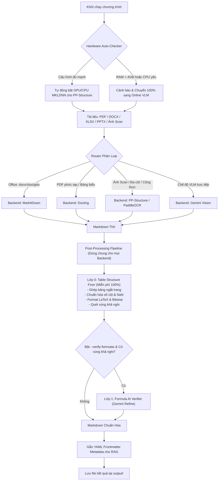

# Personal Doc Crawler – Hệ Thống Hybrid OCR, Table Structure Fixer & VLM Verification

> **Giải pháp trích xuất, phân tích bố cục, nối liền bảng ngắt trang và chuyển đổi tài liệu đa định dạng (PDF scan, Office, Hình ảnh phức tạp) sang Markdown cấu trúc chuẩn cho Obsidian, AI & RAG.**

---

## 1. Giới Thiệu Tổng Quan

**Personal Doc Crawler** kết hợp sức mạnh chuyên biệt của các công cụ Document Parsing & OCR hàng đầu theo **Kiến trúc Hybrid 2-Stage & Pipeline Hậu Xử Lý Độc Lập**:

* **Tự Động Quét Phần Cứng (Hardware Auto-Profiling):** Tự động kiểm tra CPU, RAM khả dụng, GPU NVIDIA/CUDA. Nếu cấu hình yếu (RAM < 4GB hoặc CPU < 2 cores), hệ thống cảnh báo và tự động chuyển 100% sang **Online VLM OCR** (Gemini 3.5 Flash) để tránh tràn bộ nhớ.
* **Stage 1 (Specialized Document Parsing & OCR):** Tự động phân loại định tuyến qua **MarkItDown** (Office tốc độ cao), **Docling** (PDF layout phức tạp offline), hoặc **PP-Structure / PaddleOCR** (bóc tách bảng biểu, đa cột, công thức).
* **Stage 2 (VLM Verification):** Tích hợp **Gemini 3.5 Flash** đối chiếu ảnh gốc và bản nháp Markdown từ Stage 1 để sửa lỗi chính tả, phục hồi bảng vỡ và chuẩn hóa LaTeX.
* **Post-Processing Pipeline Chung (Lớp 0 Table Structure Fixer):** Toàn bộ dữ liệu xuất từ *mọi backend* đều đi qua bộ lọc cấu trúc:
  * **Tự động nối bảng bị ngắt trang**: Tự động phát hiện và hợp nhất các phần bảng bị phân tách bởi dấu ngắt trang (`<!-- Page N -->`) hoặc dòng trống khi cùng Header signature.
  * **Chuẩn hóa số cột**: Cân bằng số lượng cell trên mỗi hàng, gộp cột dư, tự động bù cột thiếu, loại bỏ dòng toàn `NaN`.
  * **Chuẩn hóa ký tự & Toán học**: Bảo toàn phép toán bitwise (`|=`, `&=`, `^=`), tự động chuyển đổi biểu thức toán sang LaTeX (`\times`, `\le`, `\ge`, `\pm`, phân số, lũy thừa).
  * **Hỗ trợ xuất linh hoạt**: Xuất bảng chuẩn (`table`), thẻ ghi chú Q&A Callout cho Obsidian (`callout`), hoặc giữ nguyên gốc (`none`).
* **Sẵn sàng cho RAG & AI Ingestion:** Tự động sinh **YAML Frontmatter** chứa đầy đủ metadata (file nguồn, số trang, dung lượng từ, pipeline sử dụng).

---

## 2. Sơ Đồ Kiến Trúc Hệ Thống



---

## 3. Cấu Trúc Thư Mục Dự Án

```text
personal-doc-crawler/
├── .env.example                      # File mẫu hướng dẫn cấu hình API & tham số
├── config.py                         # Cấu hình hệ thống, prompts, timeouts & concurrency
├── hardware_checker.py               # Tự động quét phần cứng (CPU/RAM/GPU) & thích ứng cấu hình
├── requirements.txt                  # Danh sách thư viện phụ thuộc
├── router.py                         # Bộ định tuyến thông minh & phân tích độ phức tạp PDF
├── main.py                           # Entry-point CLI với Post-Processing Pipeline tập trung
├── backends/
│   ├── __init__.py
│   ├── markitdown_backend.py         # Trích xuất Office (docx/xlsx/pptx/csv)
│   ├── docling_backend.py            # Trích xuất layout tài liệu phức tạp offline
│   ├── paddleocr_backend.py          # PP-Structure bóc tách layout, bảng và render PDF
│   ├── gemini_vision_backend.py      # Tích hợp Google Gemini (Vision & Refiner)
│   ├── vlm_verifier.py               # Module điều phối kiểm định VLM
│   └── hybrid_pipeline.py            # Pipeline 2-Stage & sinh Frontmatter RAG
├── tools/
│   ├── table_structure_fixer.py      # [MỚI] Lớp 0: Sửa cấu trúc bảng, nối bảng ngắt trang, chuẩn hóa toán
│   └── obsidian_table_cleaner.py     # Tiện ích standalone làm sạch bảng Markdown cho Obsidian
├── tests/
│   ├── test_smoke.py                 # Smoke tests hệ thống & router
│   ├── test_obsidian_sanitizer.py    # Test suite làm sạch bảng & regex toán học
│   └── test_table_structure_fixer.py # [MỚI] Test suite kiểm thử Lớp 0 và merge bảng ngắt trang
├── test_docs/                        # Thư mục chứa tài liệu mẫu thử nghiệm
└── output/                           # Nơi lưu trữ file Markdown kết quả
```

---

## 4. Hướng Dẫn Cài Đặt Khởi Chạy Nhanh (1-Click trên Windows)

### Bước 1: Cài đặt tự động với `setup.bat`
- Mở thư mục mã nguồn vừa tải về.
- Nhấn đúp chuột vào file **`setup.bat`**.
- File sẽ tự động kiểm tra Python, tạo môi trường ảo `venv`, cài đặt thư viện cần thiết và tạo file `.env`.

### Bước 2: Sử dụng với `run.bat`
- Nhấn đúp chuột vào **`run.bat`** để mở menu tương tác chuyển đổi tài liệu dễ dàng không cần nhớ câu lệnh.

---

## 5. Hướng Dẫn Cài Đặt Thủ Công

### Bước 1: Khởi tạo và kích hoạt môi trường ảo Python (Python 3.10 - 3.12)
```powershell
# Tạo môi trường ảo
python -m venv venv

# Kích hoạt trên Windows (PowerShell):
.\venv\Scripts\Activate.ps1

# Kích hoạt trên Linux / macOS:
# source venv/bin/activate
```

### Bước 2: Cài đặt các thư viện phụ thuộc
```bash
pip install -r requirements.txt
```

### Bước 3: Cài đặt PP-Structure / PaddleOCR (Tùy chọn cho Local OCR)
```bash
# Bản CPU:
pip install paddlepaddle paddleocr

# Hoặc bản GPU (CUDA 11.8):
pip install paddlepaddle-gpu==2.6.0 -f https://www.paddlepaddle.org.cn/whl/windows/mkl/avx/stable.html
pip install paddleocr
```

---

## 6. Cấu Hình Biến Môi Trường (`.env`)

Tạo file `.env` từ file mẫu `.env.example`:
```bash
cp .env.example .env
```

Các thông số cấu hình chính:

```env
# Google Gemini API Keys (Hỗ trợ khai báo nhiều key để tự động luân phiên khi hết quota)
GEMINI_API_KEY=AIzaSy...
GEMINI_MODEL=gemini-3.5-flash

# Cấu hình kiểm định & RAG
VLM_TIMEOUT_SECONDS=45
ENABLE_RAG_METADATA=true
ENABLE_FORMULA_VERIFY=false

# Thư mục lưu trữ kết quả
OUTPUT_DIR=./output
```

---

## 7. Hướng Dẫn Sử Dụng Dòng Lệnh (`main.py`)

### 7.1. Chế Độ Mặc Định (Hybrid Pipeline)
Hệ thống tự động nhận diện định dạng file để đưa vào backend tối ưu nhất:
```bash
# Xử lý 1 file Office (.xlsx, .docx, .pptx):
python main.py "./test_docs/bang_luong.xlsx"

# Xử lý 1 file PDF scan hoặc ảnh:
python main.py "./test_docs/hop_dong_scan.pdf"

# Xử lý hàng loạt toàn bộ thư mục:
python main.py "./test_docs/"
```

### 7.2. Tùy Chọn Xuất Bảng Chuẩn Hóa Cho Obsidian (`--obsidian-mode`)
Lớp 0 Post-Processor tự động định dạng bảng cho mọi backend:
```bash
# Xuất dạng bảng Markdown chuẩn (Mặc định)
python main.py "./test_docs/data.xlsx" --obsidian-mode table

# Xuất dạng thẻ Callout Q&A tương tác cho Obsidian Flashcard
python main.py "./test_docs/data.xlsx" --obsidian-mode callout

# Giữ nguyên bản gốc nhưng vẫn sửa lỗi ngắt trang và lệch cột
python main.py "./test_docs/data.xlsx" --obsidian-mode none
```

### 7.3. Chế Độ Nhanh Hoàn Toàn Local / Offline (`--mode fast` hoặc `--no-refine`)
```bash
# Bỏ qua Stage 2 Gemini Refine để tiết kiệm API:
python main.py "./test_docs/" --no-refine

# Ưu tiên 100% các engine local:
python main.py "./test_docs/" --mode fast
```

### 7.4. Chỉ Định Backend Cụ Thể (`--backend`)
```bash
# Ép dùng MarkItDown:
python main.py "./test_docs/tai_lieu.docx" --backend markitdown

# Ép dùng Docling:
python main.py "./test_docs/tai_chinh.pdf" --backend docling

# Ép dùng Gemini Vision trực tiếp:
python main.py "./test_docs/anh_chup.jpg" --backend gemini
```

### 7.5. Chế Độ Kiểm Định Công Thức Nâng Cao (`--verify-formulas`)
```bash
# Bật kiểm định công thức toán học/hóa học phức tạp
python main.py "./test_docs/toan_cao_cap.docx" --verify-formulas
```

---

## 8. Tiện Ích Độc Lập: Obsidian Table Cleaner

Nếu bạn đã có sẵn các file Markdown xuất từ nguồn khác cần làm sạch bảng và chuẩn hóa LaTeX:
```bash
python tools/obsidian_table_cleaner.py "output/review/review.md" --mode table
python tools/obsidian_table_cleaner.py "output/review/review.md" --mode callout
```

---

## 9. Kiểm Thử Hệ Thống (Unit Tests)

Hệ thống đi kèm bộ test suite toàn diện:
```bash
# Chạy toàn bộ test
python -m unittest discover tests/ -v

# Chạy riêng kiểm thử Lớp 0 (Table Structure Fixer & Table Merging)
python -m unittest tests/test_table_structure_fixer.py -v

# Chạy kiểm thử bộ lọc Obsidian Sanitizer & Math Regex
python -m unittest tests/test_obsidian_sanitizer.py -v
```

---

## 10. Giấy Phép (License)

Dự án được phân phối dưới giấy phép **MIT License**.
