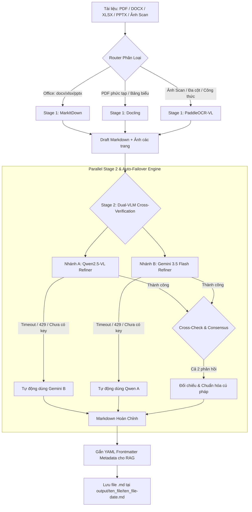

# Personal Doc Crawler – Hệ Thống Hybrid OCR & Dual-VLM Cross-Verification

> **Giải pháp trích xuất, phân tích bố cục và chuyển đổi tài liệu đa định dạng (PDF scan, Office, Hình ảnh phức tạp) sang Markdown cấu trúc chuẩn cho AI & RAG.**

---

## 1. Giới Thiệu Tổng Quan

**Personal Doc Crawler** kết hợp sức mạnh chuyên biệt của các công cụ Document OCR hàng đầu hiện nay theo **Kiến trúc Hybrid 2-Stage**:

* **Stage 1 (Specialized Document Parsing & Fast OCR):** Sử dụng **PaddleOCR-VL-1.6** (hoặc MarkItDown / Docling) đảm nhiệm nhận dạng bố cục đa cột, bảng biểu, công thức toán học và trích xuất ảnh từng trang.
* **Stage 2 (Dual-VLM Parallel Cross-Verification & Auto-Failover):** Sử dụng song song cả **Qwen2.5-VL** (chuyên sâu vision document, kiểm tra cú pháp OCR) và **Gemini 3.5 Flash** (suy luận thị giác tốc độ cao, sửa lỗi chính tả và chuẩn hóa bảng/LaTeX).
* **Cơ chế Tự Động Chuyển Vùng (Auto-Failover):** Nếu một trong hai model VLM gặp sự cố trong phiên làm việc (timeout, lỗi 429 quota, ngắt mạng, hoặc chưa cấu hình API key), hệ thống sẽ **tự động chuyển tiếp sang model còn lại** để hoàn tất quá trình verify mà không làm gián đoạn toàn bộ batch tài liệu.
* **Chuẩn hóa RAG Ready:** Tự động sinh **YAML Frontmatter** chứa đầy đủ metadata (nguồn file, số trang, token estimate, model pipeline) và làm sạch bảng Markdown, công thức toán LaTeX ($...$, $$...$$).

---

## 2. Sơ Đồ Kiến Trúc Hệ Thống



---

## 3. Cấu Trúc Thư Mục Dự Án

```text
personal-doc-crawler/
├── .env.example                  # File mẫu hướng dẫn cấu hình API & tham số
├── .env                          # File cấu hình biến môi trường thực tế
├── .gitignore                    # Bỏ qua venv, cache, file đầu ra
├── config.py                     # Quản lý cấu hình, prompts, timeouts & concurrency
├── requirements.txt              # Danh sách thư viện phụ thuộc
├── router.py                     # Bộ định tuyến thông minh & kiểm tra PDF scan
├── main.py                       # CLI entry-point hỗ trợ xử lý đơn lẻ & hàng loạt
├── backends/
│   ├── __init__.py
│   ├── markitdown_backend.py     # Trích xuất nhanh Office (docx/xlsx/pptx)
│   ├── docling_backend.py        # Xử lý PDF layout phức tạp offline
│   ├── paddleocr_backend.py      # Bóc tách cấu trúc OCR, render PDF sang ảnh
│   ├── qwen_vl_backend.py        # Tích hợp Qwen2.5-VL (OpenAI API compatible)
│   ├── gemini_vision_backend.py  # Tích hợp Google Gemini 3.5 Flash
│   ├── vlm_verifier.py           # Điều phối chạy song song & Auto-Failover
│   └── hybrid_pipeline.py        # Quản lý chuỗi 2-Stage & sinh Frontmatter RAG
├── test_docs/                    # Thư mục chứa tài liệu mẫu thử nghiệm
└── output/                       # Nơi lưu trữ file Markdown kết quả
```

---

## 4. Hướng Dẫn Cài Đặt

### Bước 1: Khởi tạo và kích hoạt môi trường ảo Python (khuyến nghị Python 3.10 - 3.12)
```bash
# Tạo môi trường ảo
python -m venv venv

# Kích hoạt trên Windows (PowerShell):
.\venv\Scripts\Activate.ps1

# Kích hoạt trên Linux / macOS:
# source venv/bin/activate
```

### Bước 2: Cài đặt các thư viện cần thiết
```bash
pip install -r requirements.txt
```

> **Lưu ý về Stage 1 PaddleOCR Local (Tùy chọn):**
> Mặc định hệ thống sử dụng `PyMuPDF` để tách ảnh và bóc tách PDF. Nếu muốn kích hoạt OCR engine cục bộ bằng PaddleOCR, bạn có thể cài thêm:
> ```bash
> # Bản CPU:
> pip install paddlepaddle paddleocr
> 
> # Hoặc bản GPU (CUDA 11.8):
> pip install paddlepaddle-gpu==2.6.0 -f https://www.paddlepaddle.org.cn/whl/windows/mkl/avx/stable.html
> pip install paddleocr
> ```

---

## 5. Hướng Dẫn Cấu Hình Biến Môi Trường (`.env`)

Tạo file `.env` từ file mẫu `.env.example`:
```bash
cp .env.example .env
```

Nội dung cấu hình chi tiết trong `.env`:

```env
# ==============================================================================
# 1. CẤU HÌNH GOOGLE GEMINI (Lấy key tại: https://aistudio.google.com/apikey)
# ==============================================================================
GEMINI_API_KEY=AIzaSy...
GEMINI_MODEL=gemini-3.5-flash

# ==============================================================================
# 2. CẤU HÌNH QWEN2.5-VL (Hỗ trợ Alibaba DashScope, OpenRouter, vLLM, Ollama)
# ==============================================================================
# Nếu dùng Alibaba DashScope API (Lấy key tại https://bailian.console.aliyun.com/):
QWEN_VL_API_KEY=sk-...
QWEN_VL_BASE_URL=https://dashscope-intl.aliyuncs.com/compatible-mode/v1
QWEN_VL_MODEL=qwen2.5-vl-72b-instruct

# Hoặc nếu dùng OpenRouter:
# QWEN_VL_BASE_URL=https://openrouter.ai/api/v1
# QWEN_VL_MODEL=qwen/qwen-2.5-vl-72b-instruct

# Hoặc nếu chạy Local vLLM / Ollama:
# QWEN_VL_BASE_URL=http://localhost:11434/v1
# QWEN_VL_API_KEY=ollama
# QWEN_VL_MODEL=qwen2.5-vl:7b

# ==============================================================================
# 3. CHẾ ĐỘ ĐỐI CHIẾU VÀ TỰ ĐỘNG FAILOVER (STAGE 2)
# ==============================================================================
# "parallel": Chạy song song cả Qwen & Gemini (Auto-Failover nếu 1 bên lỗi)
# "fallback": Thử Qwen trước, nếu lỗi chuyển tiếp sang Gemini
# "qwen_only": Chỉ dùng Qwen2.5-VL verify
# "gemini_only": Chỉ dùng Gemini 3.5 Flash verify
VLM_VERIFY_MODE=parallel
VLM_TIMEOUT_SECONDS=45
ENABLE_RAG_METADATA=true

# ==============================================================================
# 4. THƯ MỤC LƯU TRỮ ĐẦU RA
# ==============================================================================
OUTPUT_DIR=./output
```

---

## 6. Hướng Dẫn Sử Dụng Chi Tiết (A - Z)

### 6.1. Xử Lý Tự Động Theo Định Dạng (Chế Độ Mặc Định Hybrid)
Chế độ `hybrid` sẽ tự động phân loại: file Office sẽ trích xuất thần tốc qua `markitdown`, còn file PDF scan / hình ảnh sẽ đi qua luồng 2-Stage (PaddleOCR -> Qwen & Gemini đối chiếu song song).

```bash
# Chuyển đổi 1 file Office (.docx, .xlsx, .pptx):
python main.py "./test_docs/sample_report.docx"

# Chuyển đổi 1 file PDF hoặc ảnh chụp hợp đồng/bảng điểm:
python main.py "./test_docs/hop-dong-scan.pdf"

# Chuyển đổi toàn bộ thư mục tài liệu:
python main.py "./test_docs/"
```

---

### 6.2. Lựa Chọn Chế Độ Kiểm Tra Chéo ở Stage 2 (`--verify-mode`)

Bạn có thể linh hoạt chọn cách thức phối hợp giữa **Qwen2.5-VL** và **Gemini 3.5 Flash**:

* **Đối chiếu song song + Tự động Failover (Khuyến nghị cho chất lượng cao nhất):**
  ```bash
  python main.py "./docs/tai-lieu-khoa-hoc.pdf" --verify-mode parallel
  ```
  *(Gửi request đồng thời tới cả 2 model. Nếu 1 bên bận/hết quota/timeout, tự động dùng kết quả model còn lại).*

* **Chế độ Tuần Tự (Ưu tiên Qwen trước, Gemini làm dự phòng):**
  ```bash
  python main.py "./docs/tai-lieu-khoa-hoc.pdf" --verify-mode fallback
  ```

* **Chỉ sử dụng Qwen2.5-VL để verify:**
  ```bash
  python main.py "./docs/bang-ke.pdf" --verify-mode qwen_only
  ```

* **Chỉ sử dụng Gemini 3.5 Flash để verify:**
  ```bash
  python main.py "./docs/bang-ke.pdf" --verify-mode gemini_only
  ```

---

### 6.3. Chế Độ Nhanh Hoàn Toàn Local / Offline (Tiết Kiệm Token & Quota API)

Khi không có kết nối Internet hoặc muốn xử lý hàng ngàn trang tài liệu offline mà không tốn chi phí API:

* **Bỏ qua Stage 2 VLM Verification (Chỉ chạy Stage 1 OCR):**
  ```bash
  python main.py "./docs/" --no-refine
  ```

* **Chạy với profile `--mode fast` (Ưu tiên hoàn toàn các engine local):**
  ```bash
  python main.py "./docs/" --mode fast
  ```

---

### 6.4. Ép Buộc Sử Dụng Một Backend Cụ Thể (`--backend`)

* **Ép dùng MarkItDown** (cho tài liệu văn phòng chuẩn):
  ```bash
  python main.py "./docs/bao-cao.docx" --backend markitdown
  ```

* **Ép dùng Docling** (cho tài liệu PDF bảng biểu phức tạp offline):
  ```bash
  python main.py "./docs/tai-chinh.pdf" --backend docling
  ```

* **Ép dùng Gemini Vision trực tiếp:**
  ```bash
  python main.py "./docs/anh-chup.jpg" --backend gemini
  ```

* **Ép dùng Qwen2.5-VL trực tiếp:**
  ```bash
  python main.py "./docs/anh-chup.jpg" --backend qwen
  ```

---

### 6.5. Các Tùy Chọn Bổ Trợ Quan Trọng

* **`--scanned`**: Đánh dấu tài liệu PDF chắc chắn là bản scan/ảnh chụp để bỏ qua bước kiểm tra text layer và đưa thẳng vào Hybrid OCR.
* **`--rag-metadata`**: Bật chế độ tự động đính kèm YAML frontmatter chuẩn RAG ở đầu file.
* **`--overwrite`**: Ghi đè file Markdown kết quả nếu file đã tồn tại trong thư mục `output/`.

---

## 7. Định Dạng Kết Quả Xuất Ra (Chuẩn RAG Ingestion)

Mỗi tài liệu xử lý sẽ được lưu vào: `output/{ten_file}/{ten_file}-{YYYY-MM-DD}.md`.

Ví dụ nội dung file Markdown đầu ra:

```markdown
---
source_file: bao-cao-tai-chinh.pdf
converted_at: 2026-08-19T22:50:02.123456
pipeline: hybrid-2stage
stage1_engine: paddleocr-vl
stage2_verifier: "qwen2.5-vl + gemini-3.5-flash (parallel cross-verified)"
total_pages: 2
word_count: 530
---

# BÁO CÁO KẾT QUẢ KINH DOANH NĂM 2026

## 1. Tóm Tắt Chỉ Tiêu Tài Chính

Dưới đây là bảng tổng hợp các chỉ tiêu kinh doanh trọng yếu theo từng quý:

| Quý | Doanh Thu Kế Hoạch ($) | Doanh Thu Thực Tế ($) | Tỷ Lệ Hoàn Thành (%) |
| :--- | :--- | :--- | :--- |
| **Q1** | 2.500.000 | 2.680.000 | 107.2% |
| **Q2** | 3.000.000 | 3.150.000 | 105.0% |
| **Q3** | 3.200.000 | 3.400.000 | 106.25% |

## 2. Công Thức Tính Tăng Trưởng & Rủi Ro

Công thức định giá mô hình kỳ vọng:

$$\sigma^2 = \sum_{i=1}^{n} p_i (x_i - \mu)^2 \quad \text{với} \quad \mu = \mathbb{E}[X]$$
```

---

## 8. Cơ Chế Xử Lý Sự Cố & Tự Động Failover

| Tình huống sự cố | Cơ chế xử lý của hệ thống |
| :--- | :--- |
| **Qwen API hết quota / timeout / chưa cấu hình key** | Hệ thống ghi log cảnh báo và **ngay lập tức sử dụng kết quả verify từ Gemini 3.5 Flash**. |
| **Gemini báo lỗi Rate Limit 429 (Resource Exhausted)** | Hệ thống tự động kích hoạt **kết quả verify từ Qwen2.5-VL** hoặc retry với exponential backoff. |
| **Cả 2 VLM đều không phản hồi** | Hệ thống tự động sử dụng bản nháp sạch từ **Stage 1 (PaddleOCR / Docling)** mà không làm dừng chương trình. |
| **PDF chứa font CID / font nhúng lỗi** | Bộ Router tự động nhận diện và chuyển hướng sang pipeline OCR hình ảnh. |
| **Lỗi font chữ tiếng Việt trên console Windows** | Hệ thống tự động kích hoạt chế độ UTF-8 stream output để hiển thị chuẩn xác tiếng Việt. |

---

## 9. Giấy Phép & Đóng Góp

Dự án được phân phối dưới giấy phép mã nguồn mở **MIT License**. Mọi đóng góp (Pull Request, Báo lỗi Issue, Đề xuất tính năng) đều được chào đón!
