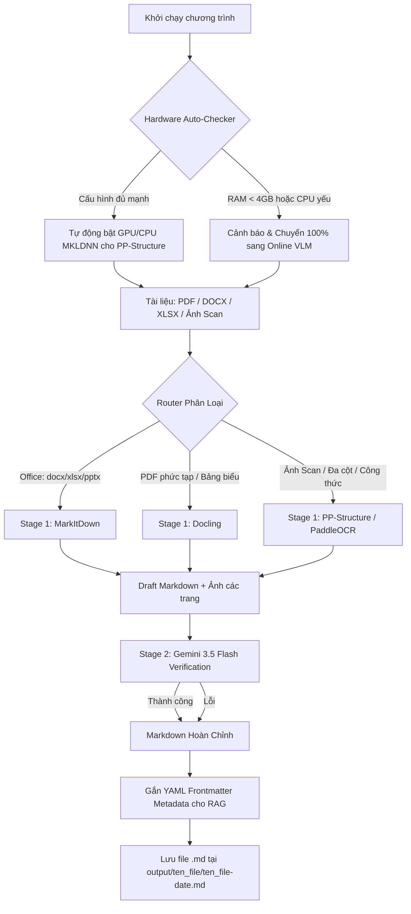

# Personal Doc Crawler – Hệ Thống Hybrid OCR & VLM Verification

> **Giải pháp trích xuất, phân tích bố cục và chuyển đổi tài liệu đa định dạng (PDF scan, Office, Hình ảnh phức tạp) sang Markdown cấu trúc chuẩn cho AI & RAG.**

---

## 1. Giới Thiệu Tổng Quan

**Personal Doc Crawler** kết hợp sức mạnh chuyên biệt của các công cụ Document OCR hàng đầu hiện nay theo **Kiến trúc Hybrid 2-Stage**:

* **Tự Động Quét Phần Cứng (Hardware Auto-Profiling):** Hệ thống tự động kiểm tra tài nguyên máy tính (CPU cores, dung lượng RAM khả dụng, GPU NVIDIA/CUDA). Nếu cấu hình máy tính quá yếu (RAM < 4GB hoặc CPU < 2 cores), hệ thống sẽ **đưa ra cảnh báo và tự động bỏ qua thiết lập OCR cục bộ, chuyển 100% sang Online VLM OCR**.
* **Stage 1 (PP-Structure & Specialized Document Parsing):** Sử dụng **PP-Structure / PaddleOCR** (hoặc MarkItDown / Docling) bóc tách bố cục đa cột, bảng biểu (chuyển trực tiếp sang Markdown Table), công thức toán học và tách từng trang tài liệu thành hình ảnh chất lượng cao.
* **Stage 2 (VLM Verification):** Sử dụng **Gemini 3.5 Flash** (suy luận thị giác tốc độ cao, sửa lỗi chính tả và chuẩn hóa bảng/LaTeX).
* **Cơ Chế Tự Động Failover:** Nếu quá trình xử lý gặp sự cố, hệ thống sẽ cố gắng tự động dùng các engine OCR khác làm dự phòng để hoàn tất quá trình mà không làm gián đoạn toàn bộ batch tài liệu.
* **Chuẩn Hóa RAG Ready:** Tự động sinh **YAML Frontmatter** chứa đầy đủ metadata (nguồn file, số trang, token estimate, model pipeline) và làm sạch bảng Markdown, công thức toán LaTeX ($...$, $$...$$).

---

## 2. Sơ Đồ Kiến Trúc Hệ Thống



---

## 3. Cấu Trúc Thư Mục Dự Án

```text
personal-doc-crawler/
├── .env.example                  # File mẫu hướng dẫn cấu hình API & tham số
├── config.py                     # Quản lý cấu hình, prompts, timeouts & concurrency
├── hardware_checker.py           # Tự động quét phần cứng (CPU/RAM/GPU) & thích ứng cấu hình
├── requirements.txt              # Danh sách thư viện phụ thuộc
├── router.py                     # Bộ định tuyến thông minh & kiểm tra PDF scan
├── main.py                       # CLI entry-point hỗ trợ xử lý đơn lẻ & hàng loạt
├── backends/
│   ├── __init__.py
│   ├── markitdown_backend.py     # Trích xuất nhanh Office (docx/xlsx/pptx)
│   ├── docling_backend.py        # Xử lý PDF layout phức tạp offline
│   ├── paddleocr_backend.py      # PP-Structure bóc tách bảng & layout, render PDF
│   ├── gemini_vision_backend.py  # Tích hợp Google Gemini 3.5 Flash
│   ├── vlm_verifier.py           # Quản lý verification bằng Gemini
│   └── hybrid_pipeline.py        # Quản lý chuỗi 2-Stage & sinh Frontmatter RAG
├── test_docs/                    # Thư mục chứa tài liệu mẫu thử nghiệm
└── output/                       # Nơi lưu trữ file Markdown kết quả
```

---

## 4. Hướng Dẫn Cài Đặt

### Bước 1: Khởi tạo và kích hoạt môi trường ảo Python (khuyến nghị Python 3.10 - 3.12)
```bash
# Tạo môi trường ảo
python -m venv venv

# Kích hoạt trên Windows (PowerShell):
.\venv\Scripts\Activate.ps1

# Kích hoạt trên Linux / macOS:
# source venv/bin/activate
```

### Bước 2: Cài đặt các thư viện cơ bản
```bash
pip install -r requirements.txt
```

### Bước 3: Cài đặt PP-Structure / PaddleOCR Cục Bộ (Tùy chọn)
Nếu máy tính của bạn đủ điều kiện phần cứng và bạn muốn chạy bóc tách bố cục & bảng biểu offline tại Stage 1:
```bash
# Bản CPU:
pip install paddlepaddle paddleocr

# Hoặc bản GPU (CUDA 11.8):
pip install paddlepaddle-gpu==2.6.0 -f https://www.paddlepaddle.org.cn/whl/windows/mkl/avx/stable.html
pip install paddleocr
```

---

## 5. Hướng Dẫn Cấu Hình Biến Môi Trường (`.env`)

Tạo file `.env` từ file mẫu `.env.example`:
```bash
cp .env.example .env
```

Nội dung cấu hình chi tiết trong `.env`:

```env
# ==============================================================================
# 1. CẤU HÌNH GOOGLE GEMINI (Lấy key tại: https://aistudio.google.com/apikey)
# ==============================================================================
GEMINI_API_KEY=AIzaSy...
GEMINI_MODEL=gemini-3.5-flash

# ==============================================================================
# 2. CẤU HÌNH TIMEOUT
# ==============================================================================
VLM_TIMEOUT_SECONDS=45
ENABLE_RAG_METADATA=true

# ==============================================================================
# 4. THƯ MỤC LƯU TRỮ ĐẦU RA
# ==============================================================================
OUTPUT_DIR=./output
```

---

## 6. Hướng Dẫn Sử Dụng Chi Tiết (A - Z)

### 6.1. Xử Lý Tự Động Theo Định Dạng (Chế Độ Mặc Định Hybrid)
Chế độ `hybrid` sẽ tự động phân loại: file Office sẽ trích xuất thần tốc qua `markitdown`, còn file PDF scan / hình ảnh sẽ đi qua luồng 2-Stage (PP-Structure/PaddleOCR -> Qwen & Gemini đối chiếu song song).

```bash
# Chuyển đổi 1 file Office (.docx, .xlsx, .pptx):
python main.py "./test_docs/sample_report.docx"

# Chuyển đổi 1 file PDF hoặc ảnh chụp hợp đồng/bảng điểm:
python main.py "./test_docs/hop-dong-scan.pdf"

# Chuyển đổi toàn bộ thư mục tài liệu:
python main.py "./test_docs/"
```


---

### 6.3. Chế Độ Nhanh Hoàn Toàn Local / Offline (Tiết Kiệm Token & Quota API)

Khi không có kết nối Internet hoặc muốn xử lý hàng ngàn trang tài liệu offline mà không tốn chi phí API:

* **Bỏ qua Stage 2 VLM Verification (Chỉ chạy Stage 1 OCR):**
  ```bash
  python main.py "./docs/" --no-refine
  ```

* **Chạy với profile `--mode fast` (Ưu tiên hoàn toàn các engine local):**
  ```bash
  python main.py "./docs/" --mode fast
  ```

---

### 6.4. Ép Buộc Sử Dụng Một Backend Cụ Thể (`--backend`)

* **Ép dùng MarkItDown** (cho tài liệu văn phòng chuẩn):
  ```bash
  python main.py "./docs/bao-cao.docx" --backend markitdown
  ```

* **Ép dùng Docling** (cho tài liệu PDF bảng biểu phức tạp offline):
  ```bash
  python main.py "./docs/tai-chinh.pdf" --backend docling
  ```

* **Ép dùng Gemini Vision trực tiếp:**
  ```bash
  python main.py "./docs/anh-chup.jpg" --backend gemini
  ```

---

### 6.5. Các Tùy Chọn Bổ Trợ Quan Trọng

* **`--scanned`**: Đánh dấu tài liệu PDF chắc chắn là bản scan/ảnh chụp để bỏ qua bước kiểm tra text layer và đưa thẳng vào Hybrid OCR.
* **`--rag-metadata`**: Bật chế độ tự động đính kèm YAML frontmatter chuẩn RAG ở đầu file.
* **`--overwrite`**: Ghi đè file Markdown kết quả nếu file đã tồn tại trong thư mục `output/`.

---

## 7. Định Dạng Kết Quả Xuất Ra (Chuẩn RAG Ingestion)

Mỗi tài liệu xử lý sẽ được lưu vào: `output/{ten_file}/{ten_file}-{YYYY-MM-DD}.md`.

Ví dụ nội dung file Markdown đầu ra:

```markdown
---
source_file: bao-cao-tai-chinh.pdf
converted_at: 2026-08-19T22:50:02.123456
pipeline: hybrid-2stage
stage1_engine: paddleocr-vl
stage2_verifier: "gemini-3.5-flash"
total_pages: 2
word_count: 530
---

# BÁO CÁO KẾT QUẢ KINH DOANH NĂM 2026

## 1. Tóm Tắt Chỉ Tiêu Tài Chính

Dưới đây là bảng tổng hợp các chỉ tiêu kinh doanh trọng yếu theo từng quý:

| Quý | Doanh Thu Kế Hoạch ($) | Doanh Thu Thực Tế ($) | Tỷ Lệ Hoàn Thành (%) |
| :--- | :--- | :--- | :--- |
| **Q1** | 2.500.000 | 2.680.000 | 107.2% |
| **Q2** | 3.000.000 | 3.150.000 | 105.0% |
| **Q3** | 3.200.000 | 3.400.000 | 106.25% |

## 2. Công Thức Tính Tăng Trưởng & Rủi Ro

Công thức định giá mô hình kỳ vọng:

$$\sigma^2 = \sum_{i=1}^{n} p_i (x_i - \mu)^2 \quad \text{với} \quad \mu = \mathbb{E}[X]$$
```

---

## 8. Cơ Chế Xử Lý Sự Cố & Tự Động Failover

| Tình huống sự cố | Cơ chế xử lý của hệ thống |
| :--- | :--- |
| **Cấu hình máy tính quá yếu (RAM < 4GB)** | Hệ thống tự động bỏ qua khởi tạo PaddleOCR/PP-Structure để tránh tràn bộ nhớ (OOM) và tự chuyển sang **Online VLM OCR**. |
| **Gemini báo lỗi Rate Limit 429 (Resource Exhausted)** | Hệ thống ghi log cảnh báo và retry với exponential backoff. |
| **VLM không phản hồi** | Hệ thống tự động sử dụng bản nháp sạch từ **Stage 1 (PP-Structure / Docling)** mà không làm dừng chương trình. |
| **PDF chứa font CID / font nhúng lỗi** | Bộ Router tự động nhận diện và chuyển hướng sang pipeline OCR hình ảnh. |
| **Lỗi font chữ tiếng Việt trên console Windows** | Hệ thống tự động kích hoạt chế độ UTF-8 stream output để hiển thị chuẩn xác tiếng Việt. |

---

## 9. Giấy Phép & Đóng Góp

Dự án được phân phối dưới giấy phép mã nguồn mở **MIT License**. Mọi đóng góp (Pull Request, Báo lỗi Issue, Đề xuất tính năng) đều được chào đón!
